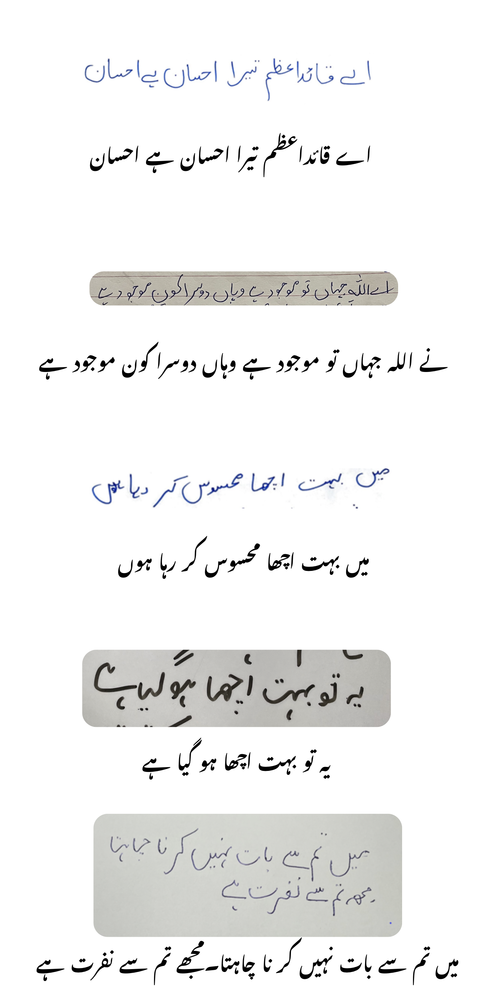

# VilanOCR: Visual Language Based OCR

VilanOCR is a state-of-the-art Optical Character Recognition (OCR) system designed to extract text from images using cutting-edge computer vision and natural language processing techniques.



## Key Features

- **State-of-the-art OCR Model:** VilanOCR employs a highly accurate OCR model pre-trained on a diverse dataset of text images.
- **Visual Language-Based Approach:** The model understands the visual structure of text, enabling it to accurately extract text from complex images with various fonts and layouts.
- **Easy Installation:** We provide a straightforward setup process for users to get started quickly.
- **Training Script:** VilanOCR includes a training script for fine-tuning the model on your own dataset.
- **Data Version Control (DVC):** Efficiently manage the large dataset used for training.
- **GitHub Repository:** The project is hosted on GitHub, making it accessible and collaborative for the community.

## Installation

To set up VilanOCR on your system, follow these steps:

1. Clone the GitHub repository:

   ```bash
   git clone https://github.com/musadac/VilanOCR.git
   cd VilanOCR
   jupyter-notebook
   ```

2. You can dowload the data using dvc github vilanocr data from this link Visit [VilanOCR Data on GitHub](https://github.com/musadac/docigize-data) 

## Pretrained Models 

To download pretrained weights you can download from huggingface from the link [VilanOCR Weights](https://huggingface.co/musadac) 

## Deploy OCR for your Use Case 

To download a sample use case flask app  weights you can download from github using link [Flask VilanOCR](https://github.com/musadac/docigize-backend.git) 

## LICENSE
   
VilanOCR is licensed under the MIT License. For more details, please refer to the LICENSE file.

Thank you for choosing VilanOCR! We hope it serves as a valuable tool for your text extraction needs. If you have questions or encounter issues, feel free to contact the project maintainers.
